# PROJECT Design Documentation

## Team Information
* Team name: Sultans of Scrum

* Team members:
  * Garrett Geyer     |  GitHub Code Review PR
  * Michael DiBiase   |  Configuration Coordinator
  * Carla Lopez       |  Design Coordinator
  * Rachel Adkins     |  Team Coordinator
  * Cheyenne Zhang    |  Quality Coordinator

## Executive Summary

Organization:      |  The organization we chose is the MIA foundation for disabled animals. 

Purpose:           |  The purpose of our project was to provide a funding website for this  foundation so that people can fund needs for the dogs in the shelter, whether they are goods or volunteer. 

Added Features:    |  The two features we added are a list of adoptable dogs with contact information that the u-fund manager can edit, a favorites list of adoptable pets that individual helpers can edit. The u-fund manager also has the new feature of uploading images of the adoptable pets.

### Purpose

The manager of the Ufund system is able to add any needs which the shelter might require to a list of needs called the Cupboard. They can modify and remove any need they add to this cupboard. Along with this they can add all pets they have at the shelter to the website, with an individual profile and picture for each. Every other user is a helper, and can peruse and search through the list of needs put up, and can add them to a funding basket, which they can proceed to fund all needs they delagate. Along with this a helper is able to look through the list of available pets, inquire about a specific pet as well as see their adoption status.

### Glossary and Acronyms

| Term | Definition |
|------|------------|
| SPA | Single Page |
| Helper | A user using the application with intent to give support|
|MVP | Minimum Viable Product|

## Requirements

The Mia Foundation U Fund website focuses on providing both helpers of the organizations and managers an optimal way of collaborating for an important cause such us supporting animals in need.
In our website the Administrator of the Funding website will be able to:
Log in to the "Admin dashboard" to see the list of needs of their organization
Add,remove, and edit the needs which are either goods or volunteer opportunities
Add remove and edit all pets currently displayed
The helper will be able to:
Log in to their "Helper" Dashboard to access the cupboard of the organization
Search for a need by name
have A personalized funding basket where they can add/delete the needs they want to checkout
View all pets available in the shelter.
Add individual pets to a favorites list, with all pets they like in the list

### Definition of MVP

Each user logs in with their username, the Ufund manager can log in with the username 'admin'.
The manager can add, remove and change needs stored in their cupboard and a helper can view that cupboard and select needs to add to their funding basket, and checkout, funding their selected needs. 

### MVP Features
  A user logs in with a username, going to their page
  A U-fund Manager logs in with username 'admin'
  A Helper can see a list of needs
  A Helper can search through the list of needs
  A Helper can add/remove a need from their Funding Basket
  A Helper can Check-out and fund all needs in their Funding Basket
  A U-fund Manager can add, remove, and edit the list of needs
  A U-fund manager cannot see each user's funding basket

### Enhancements

Added onto the MVP features is the admin's ability to track all pets currently in the shelter on the website. 
The admin can update and remova any of these pets.
An image can be uploaded to represent the pet.
A helper is able to view this list of pets, and can add pets to their individual list of favorite pets. 
When visiting the website for the first time, you are brought to a welcome page
A helper can also inquirea about any pets currenlty avialable
From the welcome page you can continue to either login or signup, creating a new account with the website.

## Application Domain

This section describes the application domain.

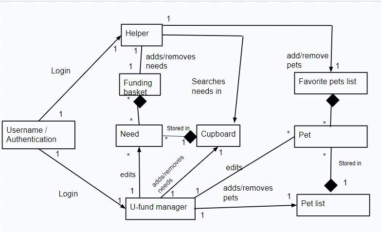

The domain has a handful of important entities. The Need and Pet objects are the main heart of the site, being interacted with by all users of the site. The admin can update all the needs and pets, which the list of all needs are stored in the cupboard, and the pets have a list of all pets. The helpers aren't able to edit any of these objects, but they have the ability to look through all the pets and needs, and can search for specific needs. After seeing these, each helper has two lists, one for Pets and one for Needs, their Favorite pets list and funding basket and can feely add any displayed entites to its respective list. 

## Architecture and Design

This section describes the application architecture.

### Summary

The web application, is built using the Model–View–ViewModel (MVVM) architecture pattern. 

The Model stores the application data objects including any functionality to provide persistance. 

The View is the client-side SPA built with Angular utilizing HTML, CSS and TypeScript. The ViewModel provides RESTful APIs to the client (View) as well as any logic required to manipulate the data objects from the Model.

Both the ViewModel and Model are built using Java and Spring Framework. Details of the components within these tiers are supplied below.

The ViewModel and Model steps are implemented for each individual part of the system, so there is a seperate Models and controllers for Users, Pets, Needs, FundingBaskets and FavoritePet lists.

### Overview of User Interface

This section describes the web interface flow; this is how the user views and interacts with the web application.

 Our web application's user interface offers a clear and structured  for the user roles of Manager and Helper. All users can log in and access their personal "dashboard". If the user decides to have the role of "Helper", their personal page or dahsboard will display a list of available needs in the organization. Furthermore, they will be able to view and manage their Funding Basket ,which includes adding and removing needs. The Helper view also contains a feature which allows users to search needs by a specific name type and access a detail description of said need. There are also buttons on the navigation bar at the top of the screen to redirect to the helper's funding basket, the list of all pets, and the user's favorite pet list.

On the other, the 'admin" or " U-fund manager, logs in to an administrative dashboard where they can oversee and and modify the needs in their cupboard, as well as the pets in the shelter. They can freely navigate to pages to update both needs and pets, and have simple and obvious bottons for removing. 
 Both user roles have the opportunity to log out of the site whenever it is convenient, and both have to login through the same page.
 A helper can also sign up if they havent been to the site before, there is an obvious marker to redirect to the signup page.
 When first visiting the site you are brought to a welcome page with basic information from which you can proceed to login or signup pages. 

### View Tier

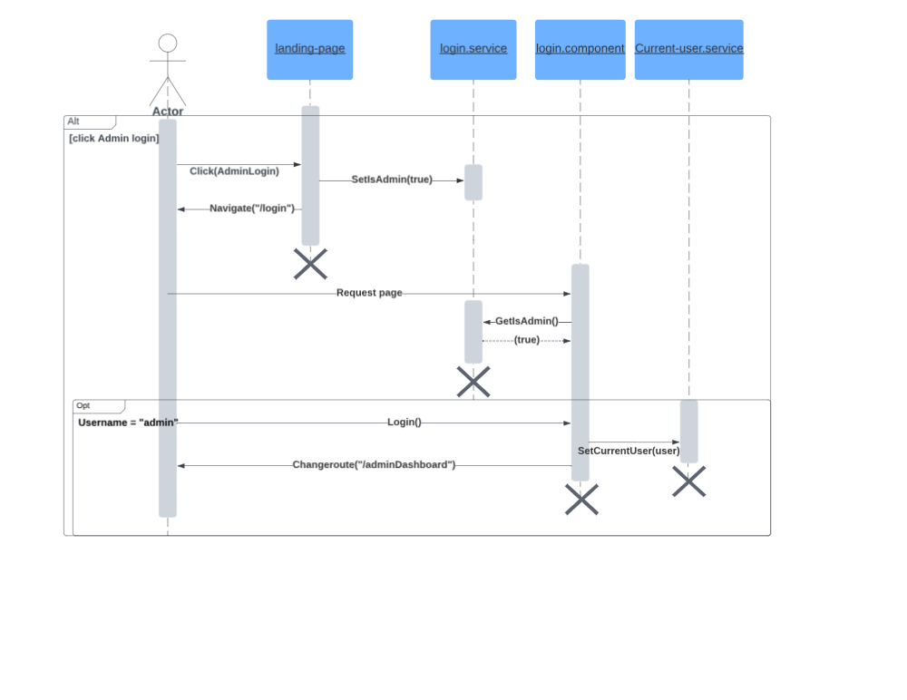
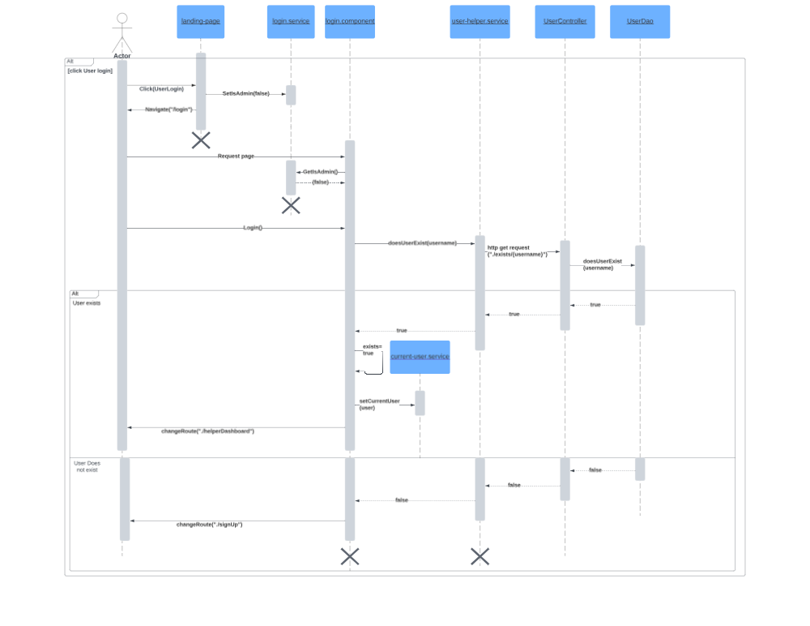

The diagrams above illustrate admin and users logging into our website. The first diagram is a user logging in while the second is the path of a user logging in.

Starting from the top the user clicks on admin login on the landing page. From there the landing page a call is made to set the value of admin is true in the login service. the landing page then redirects the user to the login page. The user then gets the login page, the login page then checks if admin in login service is true or not. The login service returns true, the true or false changes the display if the user is an admin. Then on the login page the user enters the username of admin. The user then clicks the login button, the login component after then takes the user and sets them to the current user. The current-user service is called with that user to set this. the login component then sends the admin to the admin dashboard page with changeroute. This ends the admin logging as they are now logged into the website.

From the user's side logging in starts with the user clicking log in as user. This then tells the login service to set admin as false. The landing page then navigates the user to the login page. Then the user gets the login page. The login then checks if admin is true in the login service or not. Since it is false, the login component displays the proper login page for a user. The user then enters a username into this log in page and submits it. Then the login component calls doesUserExist in the user-helper service. This then calls a get request to the user controller to find if a user exists. Then the controller calls doesUserExist to the userDao which looks to find out if the user does exist or not. Then the UserDao returns either true or false. The first possibility is if the user exists, in this case the UserDao returns true. Then the UserController reutnrs true to the user-helper service which its self returns true to the login component. After this the login component sets the internal exist variable to true and calls current user service to set the now logged in and validated user to the current user of the website. Finally the login component redirects the user the helper dashboard page as they have been logged in and can now enter the website. The alternative, if the user does not exist has the UserDao return false as the username is not found, false is continually returned as shown until it reaches the login component. Since the user does not exist then the login page redirects the user to the sign-up page as the user does not exist.

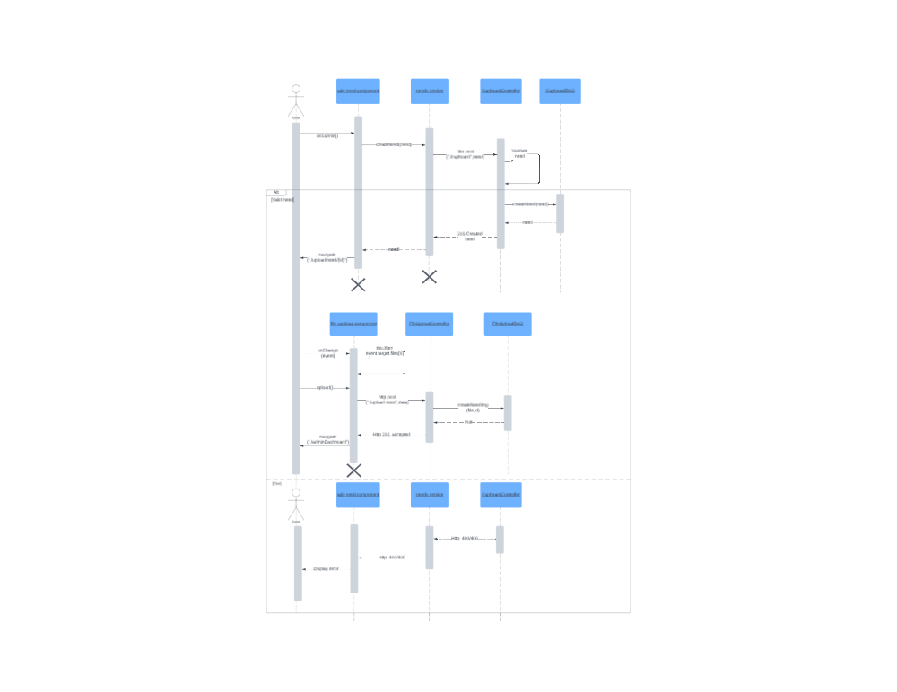
The diagram above shows the process of an admin adding a need to the cupboard. 
This diagram starts with an admin adding all the data into the form on the add need page. Then the admin hits the submit button which calls the onSubmit function. This passes then has the add need component call creatNeed with the need created from the submitted form from the needs-service. This call tells the needs-service to pass this need to the controller by using a post call. An http post call is made with this need to the controller. The CupboardController then takes that needs and checks it's values to make sure its valid. The first case shown is when the need is valid. In this case the valid need is sent from the controller to the CupboardDAO. The CupboardDAO then writes has the need stored and returns the need. Then the controller sends a 201 created status as well as the need forward back to the needs-service. Following that the need is sent from the service to the add-need component. The add-need component then redirects the user to the upload page with the created need's id in the url. Then the user is now on the file-upload page. After that when the user selects a file to be uploaded as the photo to be displayed for the need the onChange is called which causes the file-upload component sets file to that which is added by the user. Then when the user hits upload the file the file upload component takes this file and sends a post request to the fileupload controller. This post request sends data which contains the file and the id of the need. The file upload controller then takes the file and the id sent and calls createNeedImg with the file and id to the FileUploadDAO. The DAO then copies the image into the repository and returns true. From there the FileUploadController sends a 202 http status which means the image was accepted. This then prompts the file-upload component to direct the user to admin dashboard as the need has been added. If the need is not valid the cupboard controller then sends an http status of 400 or 406 meaning there was an error. Then needs service gets the erro and passes it forward to the add-need component. Following that the add-need component then displays an error to the user based on the error passed.

### ViewModel Tier

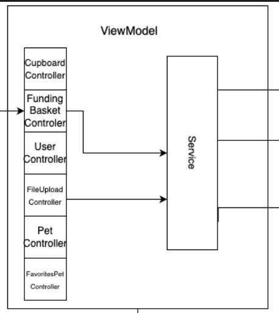
In our application's architecture, the View-Model tier plays a pivotal role in facilitating interactions between the View (UI) and the underlying Model. We've identified six controller classes, each tasked with managing specific functionalities within our application:

#### User Controller
   - Accepts and manages requests from the View related to user functionality.
   - Handles CRUD operations concerning the creation and retrieval of users within the system.
   - Updates the Model tier while maintaining a clear separation between the View tier and User model tier.

### Cupboard Controller

  - Manages HTTP requests originating from the View that pertain to the needs and cupboard functionality.
  - Handles CRUD operations for Need objects within the Model Tier.
  - Isolates the Need model classes, ensuring their independence from direct View tier requests while providing necessary data.

### Funding Basket Controller

- Handles HTTP requests originating from the View only related to the user's funding basket functionality.
- Creates, updates, deletes, and retrieves funding basket objects in the Model tier.
- Separates the Funding Basket Model, enabling it to operate independently without direct involvement from the View tier.

### FileUpload Controller

   - Manages CRUD operations associated with image creation and deletion within the system.
   - Accepts requests from the View tier and facilitates data transmission to the View.
   - Updates the Model and receives notifications from the Model tier, ensuring that there's no direct communication between the View and the FileUpload model tiers.

### Pet Controller

   - Handles HTTP operations related to the pet adoption feature from the View.
   - Manages CRUD operations for pet objects in the Model tier, including creating, updating, deleting, and retrieving pet data.
   - Isolates the Pet model classes from direct requests of the View while providing necessary data to the View tier.

### Favorite Pets Controller

- Manages HTTP requests coming from the View regarding only the user's favorite pets functionality.
- Creates, updates(by adding/deleting a Pet object), deletes, and retrieves favorite pets objects in the Model tier.
- Separates the Favorite Pets Model, allowing it to function independently without direct involvement from the View tier.

### Model Tier

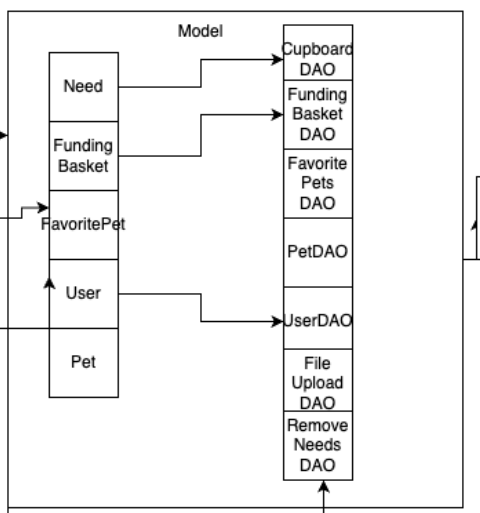

- The model tier of our application contains 5 main entities:

- Need
- Funding Basket
- User
- Pet
- Favorite Pet List
Each on of them has a specific function within the application.
The Need entity represents a good/volunteer opportunity that admin users can create and modify and that helper users can checkout to support the organization
Funding Basket entity represent a unique basket that associated to a a particular username.
User entity represents a helper user that logs in to the application. User are identified by a unique username. 
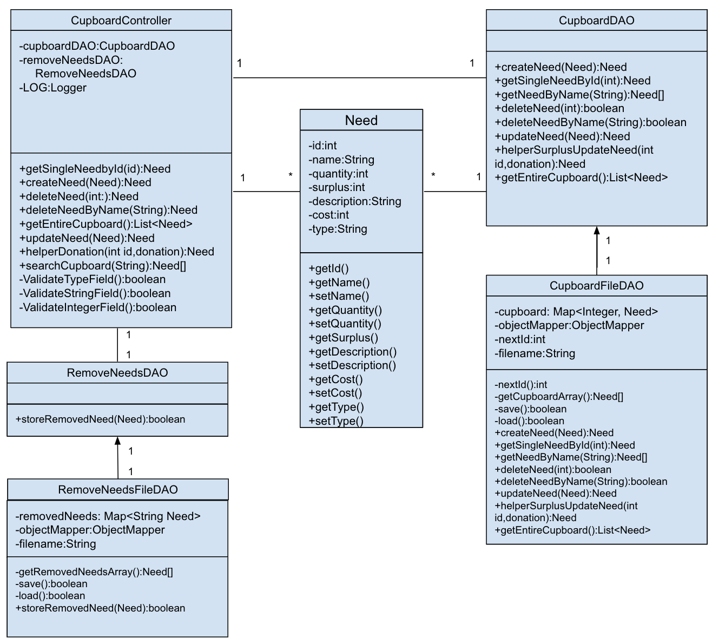
The pet represents a pet in the shelter, with all information including adoption status and the ability to inquire about the pet.
The Favorite list keep track of, for each user, what that user's favorite pets are, which they can add/removve any available pets from this list.
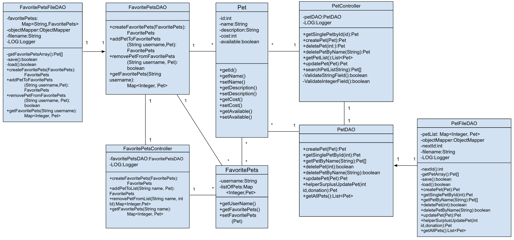
The model tier forms the backbone of our application's architecture with the Need, Funding Basket, Pet, Favorite Pets, and User entities playing distinct but interconnected roles. 

> _At appropriate places as part of this narrative provide **one** or more updated and **properly labeled**
> static models (UML class diagrams) with some details such as critical attributes and methods._
> 

## OO Design Principles

The MIA Foundation U Fund website has been thoughtfully designed to align with two fundamental Object-Oriented (OO) design principles: High Cohesion and the Single Responsibility Principle (SRP). These principles are reflected in both the frontend (Angular) and backend (Java) components and modules. 

The Single Responsibility Principle (SRP) is well implemented, ensuring that each class or module has a single, well-defined responsibility. In the frontend, different components are dedicated to specific views or tasks. For example, the navigation bar component focuses solely on navigation, avoiding mixed responsibilities. This design principle is also evident in the backend, where user management and funding basket functionalities are separated into different controllers. Users are isolated in their primary task of logging in, while the Funding Basket Controller exclusively handles operations related to the basket, such as adding and removing needs.

High Cohesion is evident in the design, where related responsibilities are grouped together within modules. For instance, in the Angular frontend, the navigation bar component has a specific purpose: facilitating user navigation. Initially, this navigation was included in various modules, but the team recognized that it deserved a module of its own. With this implementatin ,the navbar can be implemented in different components of the applicatin avoiding repetition.

The Law of Demeter is the principle to not have any of your implementations reach over through other classes implemented. So each object is only allowed to interact with a specific set of neighbor classes. This protects against any unintended coupling from occuring throughout the system. This is in tandem with another principal of low cohesion. If the program starts violating the Law of Demeter is affects the amount of coupling you have even if you dont directly import more classes. This is shown in the design with the creation of more helper methods rather than continuing to instantiate upon previous methods. One example is in the funding basket Data access object, there is a function to return all funding baskets which could be used to fetch an individual user's basket from, but instead a new method was implemented to return a specific basket you would be looking for.

Information Expert is implemented such that little to none work has to be done after calling a function. That is to say functions are implemented to return usable values, rather than returning something which has to modified or checked against another set of requirements. An example of this is with a function implemented to check if a user is new or not, simple returning a boolean rather than using a previously implemented function to return all users, then checking that for duplicate upon returning.

Open/Closed is the principle of using instantiation and inheritance in the design. This is seen mainly in our DAO implementations, which all have an abstraction form a seperate class in their implementation. Many of our systems contain very individual functionaliy and prevent a significant quantity of instantiation from occuring.

Dependency Injection is incorporated into our design by calling our File Data Access Object classes through the more general Data Access Object classes. The functions required within the File Data Access Object classes are not called within the classes internally, but are instead called in the Data Access Object classes. Then, the File Data Access Object classes implement the Data Access Object classes as well as the functions that are created within them.

By following these OO design principles, the MIA Foundation U Fund website has a maintainable and extensible code, enhancing the overall quality of the project.

## Static Code Analysis

The open source platform Sonar Qube was used to analyze and review our codebase.

Sonar Qube highlighted several areas within our codebase that need improvements and/or changes. The main categories  flagged were:
- Clean code attribute
- Software Quality
- Type

### Clean code attribute

Within the clean code attribute, the Sonar Qube reported that we had issues regarding the intentionality, consistency, and adaptability of our codebase. 

Consistency: 
- One persistent error identified was related to the naming convention of our constant variables. SonarQube flagged that our constant names did not adhere to the defined regular expression ^[A-Z][A-Z0-9]*(_[A-Z0-9]+)*$. This rule aims to ensure that all constant names match the provided regular expression.

We  failed to meet this standard, which has repercussions for the readability and maintainability of our codebase. Adhering to the specified naming convention for constants is crucial, as it significantly impacts code comprehension.
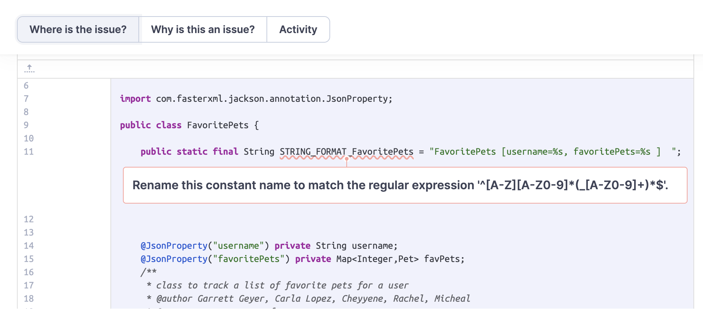

Intentionality:
- Unused Imports: A persistent issue identified in the codebase was the presence of unused imports. These unnecessary imports clutter the code and can negatively impact its readability. It's important to regularly remove unused imports to maintain a clean and efficient codebase.
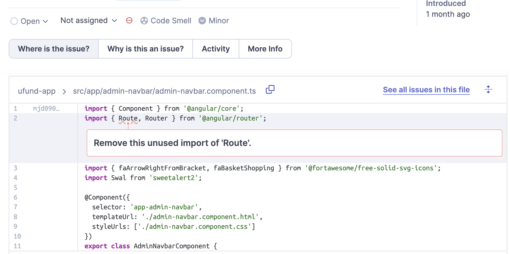

- Unit Testing Assertions: In unit testing scenarios, there's a noted recommendation to swap the arguments during assertions. This practice aligns with standard assertion library methods where the first argument is the expected outcome and the second argument is the actual value being tested. Despite not impacting the outcome of the test, adhering to this convention aligns our unit tests with the correct practices.

Adaptablity:
- The most common adaptability error in our codebase is regarding not having assertion tests cases within our unit tests. Sonar Qube says that: "A test case without assertions ensures only that no exceptions are thrown. Beyond basic runnability, it ensures nothing about the behavior of the code under test."  Notably, the FileUpload Controller Test class prominently exhibits this issue. The complexity of the FileUpload Controller Test class posed challenges for our team regarding testing strategies. As a team, we didn't know how to appropriately test it. In the future, our team aims to reach out for help or investigate how to test a code that contains a file upload functionality
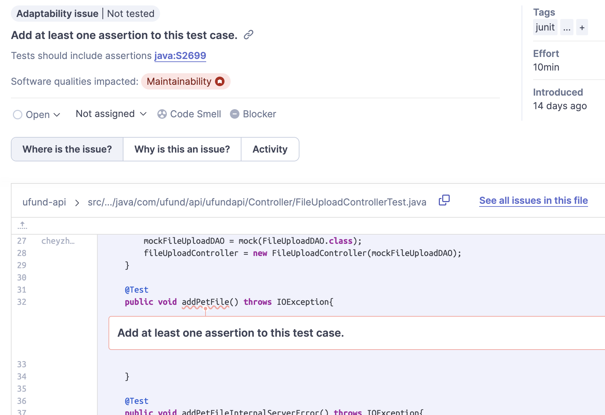

### Software Quality

Within the software quality attribute, the Sonar Qube reported that we had issues regarding the maintainability and reliability

- Maintainability: Issues related to maintainability are similar to those highlighted under the Intentionality section of the Clean Code attribute, focusing on unused imports and unit testing assertions. The presence of unused imports impacts maintainability by cluttering the codebase, while the improper use of unit testing assertions complicates future maintenance efforts.
- Reliability:  Regarding reliability, a persistent issue encountered within our codebase is having unexpected duplicates of the same CSS properties when styling. It's crucial to note that CSS permits duplicate property names, yet only the last instance of a duplicated name dictates the actual value that will be applied. Therefore, changing values of other occurrences of a duplicated name will have no effect and may cause misunderstandings and bugs.
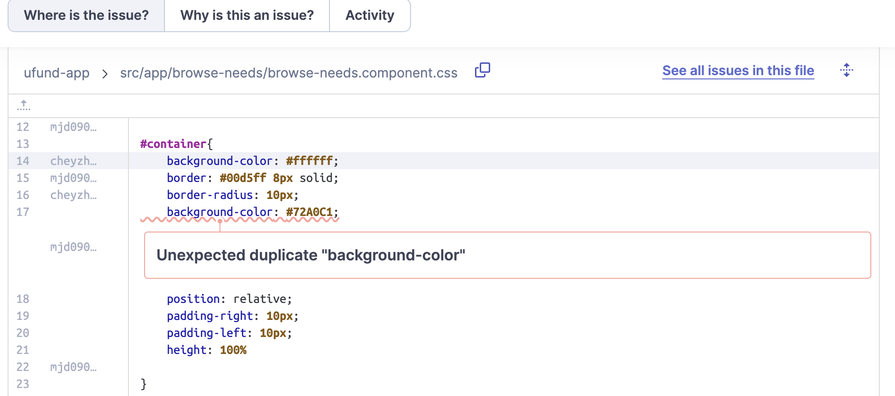

### Type

Within the type attribute, the Sonar Qube reported that we had issues regarding Bugs within our codebase.

- Bugs: : Issues related to maintainability are similar to those highlighted under the Reliability section of the Software Quality attribute. CSS duplications can cause bugs within the styling of our code. Furthermore, an additional issue encountered is having if statements that contain the same implementation Sonar qube recommends to edit the code block so what happends inside the if statemnt isn't the same as what happens outside of it.

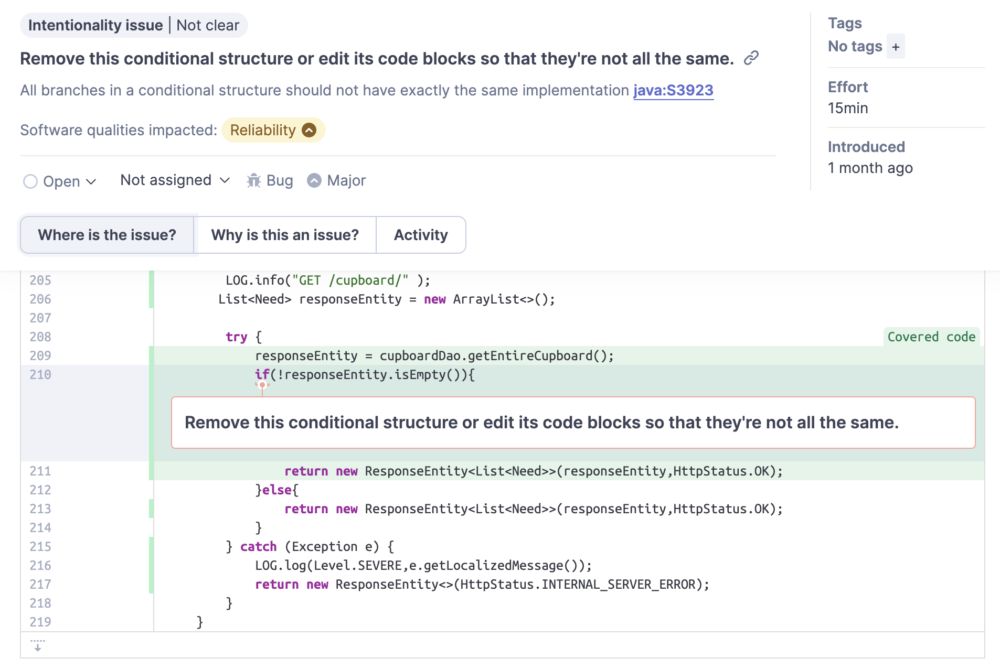

## Improvements Since Sprint 3

We have not made changes to the code due to Sprint 4 being a "no coding" sprint. However, we have reflected on our software design and considered the strong and weak points. We also took suggections during the Cross Team Design Document Review and further assessed possible improvements that would benefit the software if given more time.

## Future Design Improvements

- Password authentication: Our current login feature requires a user to log in and sign up with only their username. In order to address this potential security issue, it would be helpful implement a password
in order to protect user privacy.

- Colorblind-user friendly styling: Although we have a universal color scheme, it may present issues to those who may experience color blindness to certain colors. Another possible improvement to address this would be to choose a color palette that would  be more user friendly. 

## Testing

The code for the ufund API was tested using "mvn clean test jacoco:report" from the terminal, which gives the code coverage for each tier, calculated from how much of the code is tested using unit tests. The overall code coverage is 93%. Unit tests determine which individual functions work properly. All unit tests created were passed. 

The functionality of the program for the overall ufund project was tested using acceptance testing, meaning the Sultans of Scrum team ran through the program testing each user story to make sure it met the acceptance criteria. To re-inforce tesing accuracy, another team cross-validated the data by doing acceptance testing on our program also. Both times acceptance testing was completed, all user stories and epics passed and all acceptance criteria was met.

Overall, the code did very well in both types of testing. It can always be inproved by adding more unit tests and improving user stories, but the current state of testing is very good. The code performed well during testing, meeting the specified criteria and even exceeding some criteria such as styling and usability.

### Acceptance Testing

All user stories and epics have been through acceptance testing and 19 out of 19 user stories have passed acceptance testing. User stories were tested by our team the Sultans of Scrum, as well as tested by the other team. No user stories have currently failed acceptance testing by either team. All acceptance criteria listed in the acceptance test plan was met. 

### Unit Testing and Code Coverage

Unit testing was performed on the coverage targets of the three main tiers of the ufund api program, persistence, controller, and model. These three targets were chosen because they make up the model, view, and model-view tiers and are where the basis of the entire ufund program is kept. Overall, the unit testing has code coverage of 93%, so the code is thoroughly tested.

U-fund API Code Coverage Image:
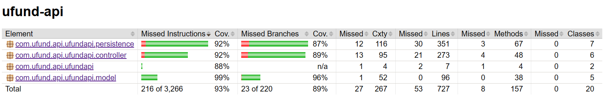

- Persistence: The persistence tier includes the file DAO classes. It has 92% code coverage overall, meaning it is very well tested, but a few more tests could be added. This is one of the hardest tiers to test due to the complexity of the file DAOs. All tests created for this tier passed.

Persistence Tier Code Coverage Report Image:
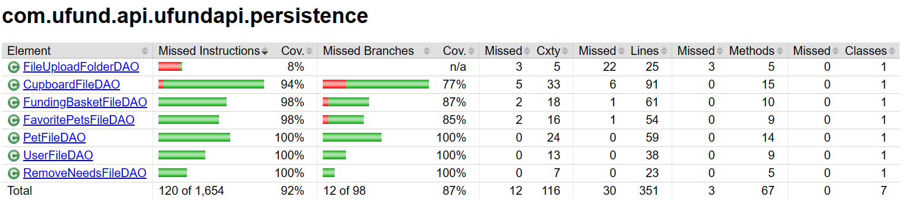

- Controller: The controller tier modifies data in the backend and holds the controller classes such as UserController, CupboardController and others. It has 92% code coverage overall, meaning it is very well tested. All tests created for this tier passed.

Controller Tier Code Coverage Report Image:
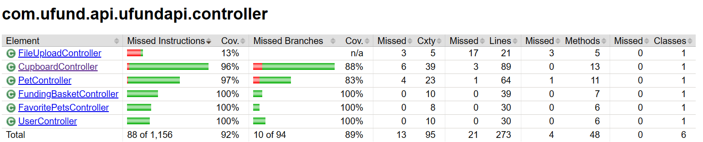

- Model: The model tier holds the building blocks of the other classes including defining a Need, User, FundingBasket, etc. It has 99% code coverage overall, meaning it is very well tested. All tests created for this tier passed.

Model Tier Code Coverage Report Image:
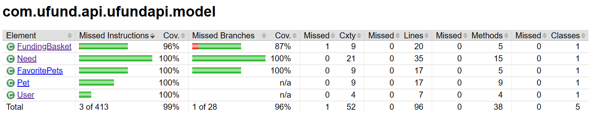

## Use of Postman API Platform for Sprint 1 RestAPI Demo
- The Postman API Platform will be used to manage and document the Restful API's of our application. Postman is a development tool which helps build, test and modify API's. Postman offers a usr-friendly graphical interface that makes it easier for the team of developers, as well as the product owner, to interact with API's. The team "Sultans of Scrum" has a "workspace" in which the Restful API's of our applciation will be stored. The workspace facilitates collaboration in the team by allowing us to share our collection of API's and maintain a record of them.

### Use of Sweet Alert Library
- The team of developers has chosen to incorporate the SweetAlert JavaScript library to enhance the user experience by offering visually appealing and user-friendly pop-up dialogs for web development. This choice not only elevates the user experience but also improves the presentation of important information and messages to users. 

### Use of Tailwind CSS
- Our decision to incorporate Tailwind CSS into our development stack was driven bu its effiency and flexibility to create UI components. The framework allowed us to rapidly build our front end without the need for extensive custom styling

- As a team with varying levels of experience using the framework, we found Tailwind's documentations and tutorials as very helpful resources. Following these tutorials enabled us to quickly grasp the fundamentals of Tailwind CSS and leverage its features effectively

