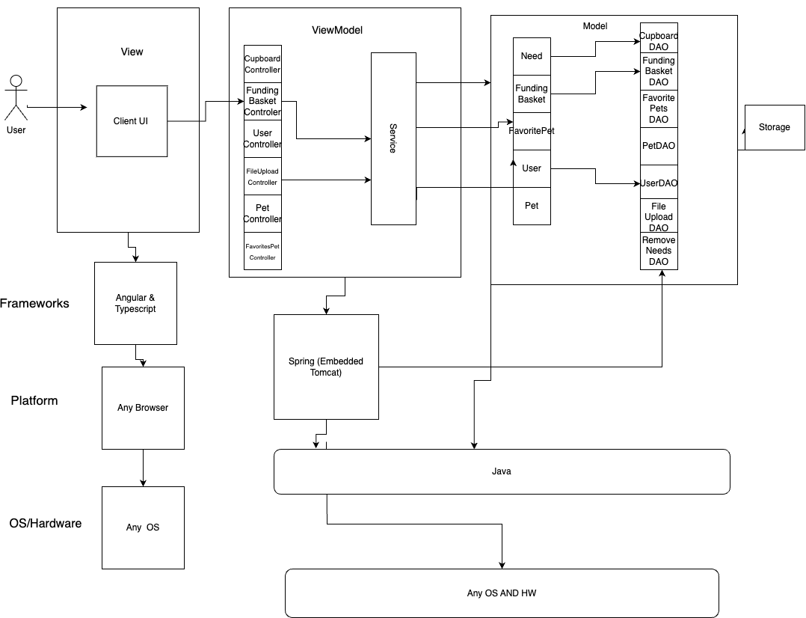

# PROJECT Design Documentation

> _The following template provides the headings for your Design
> Documentation.  As you edit each section make sure you remove these
> commentary 'blockquotes'; the lines that start with a > character
> and appear in the generated PDF in italics._

## Team Information
* Team name: Sultans of Scrum

* Team members:
  * Garrett Geyer     |  GitHub Code Review PR
  * Michael DiBiase   |  Configuration Coordinator
  * Carla Lopez       |  Design Coordinator
  * Rachel Adkins     |  Team Coordinator
  * Cheyenne Zhang    |  Quality Coordinator

## Executive Summary

This is a summary of the project.

### Purpose
>  _**[Sprint 2 & 4]** Provide a very brief statement about the project and the most

The manager of the Ufund system is able to add any needs which the shelter might require to a list of needs called the Cupboard. They can modify and remove any need they add to this cupboard. Along with this they can add all pets they have at the shelter to the website, with an individual profile and picture for each. Every other user is a helper, and can peruse and search through the list of needs put up, and can add them to a funding basket, which they can proceed to fund all needs they delagate. Along with this a helper is able to look through the list of available pets, inquire about a specific pet as well as see their adoption status.

### Glossary and Acronyms
> _**[Sprint 2 & 4]** Provide a table of terms and acronyms._

| Term | Definition |
|------|------------|
| SPA | Single Page |
| Helper | A user using the application with intent to give support|
|MVP | Minimum Viable Product|

## Requirements

This section describes the features of the application.

 The Mia Foundation U Fund website focuses on providing both helpers of the organizations and managers an 
optimal way of collaborating for an important cause such us supporting animals in need.
 In our website the Administrator of the Funding website will be able to:
 Log in to the "Admin dashboard" to see the list of needs of their organization
Add,remove, and edit the needs which are either goods or volunteer opportunities
Add remove and edit all pets currently displayed
The helper will be able to:
Log in to their "Helper" Dashboard to access the cupboard of the organization
Search for a need by name
have A personalized funding basket where they can add/delete the needs they want to checkout
View all pets available in the shelter.
Add individual pets to a favorites list, with all pets they like in the list
### Definition of MVP

>  _**[Sprint 2 & 4]** Provide a simple description of the Minimum Viable Product._

Each user logs in with their username, the Ufund manager can log in with the username 'admin'.
The manager can add, remove and change needs stored in their cupboard and a helper can view that cupboard and select needs to add to their funding basket, and checkout, funding their selected needs. 

### MVP Features
  A user logs in with a username, going to their page
  A U-fund Manager logs in with username 'admin'
  A Helper can see a list of needs
  A Helper can search through the list of needs
  A Helper can add/remove a need from their Funding Basket
  A Helper can Check-out and fund all needs in their Funding Basket
  A U-fund Manager can add, remove, and edit the list of needs
  A U-fund manager cannot see each user's funding basket

### Enhancements
> _**[Sprint 4]** Describe what enhancements you have implemented for the project._
Added onto the MVP features is the admin's ability to track all pets currently in the shelter on the website. 
The admin can update and remova any of these pets.
An image can be uploaded to represent the pet.
A helper is able to view this list of pets, and can add pets to their individual list of favorite pets. 
When visiting the website for the first time, you are brought to a welcome page
A helper can also inquirea about any pets currenlty avialable
From the welcome page you can continue to either login or signup, creating a new account with the website.

## Application Domain

This section describes the application domain.

> _**[Sprint 2 & 4]** Provide a high-level overview of the domain for this application. You
> can discuss the more important domain entities and their relationship
> to each other._

## Architecture and Design

This section describes the application architecture.

### Summary

The following Tiers/Layers model shows a high-level view of the webapp's architecture. 
**NOTE**: detailed diagrams are required in later sections of this document. (_When requested, replace this diagram with your **own** rendition and representations of sample classes of your system_.) 

The web application, is built using the Model–View–ViewModel (MVVM) architecture pattern. 

The Model stores the application data objects including any functionality to provide persistance. 

The View is the client-side SPA built with Angular utilizing HTML, CSS and TypeScript. The ViewModel provides RESTful APIs to the client (View) as well as any logic required to manipulate the data objects from the Model.

Both the ViewModel and Model are built using Java and Spring Framework. Details of the components within these tiers are supplied below.

The ViewModel and Model steps are implemented for each individual part of the system, so there is a seperate Models and controllers for Users, Pets, Needs, FundingBaskets and FavoritePet lists.

### Overview of User Interface

This section describes the web interface flow; this is how the user views and interacts with the web application.

> _Provide a summary of the application's user interface.  Describe, from the user's perspective, the flow of the pages in the web application._

 Our web application's user interface offers a clear and structured  for the user roles of Manager and Helper. All users can log in and access their personal "dashboard". If the user decides to have the role of "Helper", their personal page or dahsboard will display a list of available needs in the organization. Furthermore, they will be able to view and manage their Funding Basket ,which includes adding and removing needs. The Helper view also contains a feature which allows users to search needs by a specific name type and access a detail description of said need. There are also buttons on the navigation bar at the top of the screen to redirect to the helper's funding basket, the list of all pets, and the user's favorite pet list.

On the other, the 'admin" or " U-fund manager, logs in to an administrative dashboard where they can oversee and and modify the needs in their cupboard, as well as the pets in the shelter. They can freely navigate to pages to update both needs and pets, and have simple and obvious bottons for removing. 
 Both user roles have the opportunity to log out of the site whenever it is convenient, and both have to login through the same page.
 A helper can also sign up if they havent been to the site before, there is an obvious marker to redirect to the signup page.
 When first visiting the site you are brought to a welcome page with basic information from which you can proceed to login or signup pages. 

### View Tier
> _**[Sprint 4]** Provide a summary of the View Tier UI of your architecture.
> Describe the types of components in the tier and describe their
> responsibilities.  This should be a narrative description, i.e. it has
> a flow or "story line" that the reader can follow._

> _**[Sprint 4]** You must  provide at least **2 sequence diagrams** as is relevant to a particular aspects 
> of the design that you are describing.  (**For example**, in a shopping experience application you might create a 
> sequence diagram of a customer searching for an item and adding to their cart.)
> As these can span multiple tiers, be sure to include an relevant HTTP requests from the client-side to the server-side 
> to help illustrate the end-to-end flow._

> _**[Sprint 4]** To adequately show your system, you will need to present the **class diagrams** where relevant in your design. Some additional tips:_
 >* _Class diagrams only apply to the **ViewModel** and **Model** Tier_
>* _A single class diagram of the entire system will not be effective. You may start with one, but will be need to break it down into smaller sections to account for requirements of each of the Tier static models below._
 >* _Correct labeling of relationships with proper notation for the relationship type, multiplicities, and navigation information will be important._
 >* _Include other details such as attributes and method signatures that you think are needed to support the level of detail in your discussion._

### ViewModel Tier
> _**[Sprint 4]** Provide a summary of this tier of your architecture. This
> section will follow the same instructions that are given for the View
> Tier above._

> _At appropriate places as part of this narrative provide **one** or more updated and **properly labeled**
> static models (UML class diagrams) with some details such as critical attributes and methods._
> 

### Model Tier
> _**[Sprint 2, 3 & 4]** Provide a summary of this tier of your architecture. This
> section will follow the same instructions that are given for the View
> Tier above._

> The model tier of our application contains 5 main entities:

- Need
- Funding Basket
- User
- Pet
- Favorite Pet List
Each on of them has a specific function within the application.
The Need entity represents a good/volunteer opportunity that admin users can create and modify and that helper users can checkout to support the organization
Funding Basket entity represent a unique basket that associated to a a particular username.
User entity represents a helper user that logs in to the application. User are identified by a unique username. 
The pet represents a pet in the shelter, with all information including adoption status and the ability to inquire about the pet.
The Favorite list keep track of, for each user, what that user's favorite pets are, which they can add/removve any available pets from this list.
The model tier forms the backbone of our application's architecture with the Need, Funding Basket, Pet, Favorite Pets, and User entities playing distinct but interconnected roles. 

> _At appropriate places as part of this narrative provide **one** or more updated and **properly labeled**
> static models (UML class diagrams) with some details such as critical attributes and methods._
> 

## OO Design Principles
> _**[Sprint 2, 3 & 4]** Will eventually address upto **4 key OO Principles** in your final design. Follow guidance in augmenting those completed in previous Sprints as indicated to you by instructor. Be sure to include any diagrams (or clearly refer to ones elsewhere in your Tier sections above) to support your claims._

The MIA Foundation U Fund website has been thoughtfully designed to align with two fundamental Object-Oriented (OO) design principles: High Cohesion and the Single Responsibility Principle (SRP). These principles are reflected in both the frontend (Angular) and backend (Java) components and modules. 

The Single Responsibility Principle (SRP) is well implemented, ensuring that each class or module has a single, well-defined responsibility. In the frontend, different components are dedicated to specific views or tasks. For example, the navigation bar component focuses solely on navigation, avoiding mixed responsibilities. This design principle is also evident in the backend, where user management and funding basket functionalities are separated into different controllers. Users are isolated in their primary task of logging in, while the Funding Basket Controller exclusively handles operations related to the basket, such as adding and removing needs.

High Cohesion is evident in the design, where related responsibilities are grouped together within modules. For instance, in the Angular frontend, the navigation bar component has a specific purpose: facilitating user navigation. Initially, this navigation was included in various modules, but the team recognized that it deserved a module of its own. With this implementatin ,the navbar can be implemented in different components of the applicatin avoiding repetition.

The Law of Demeter is the principal to not have any of your implementations reach over through other classes implementet. So each object is only allowed to interact with a specific set of neighbor classes. This protects against any unintended coupling from occuring throughout the system. This is in tandem with another principal of low cohesion. If the program starts violating the Law of Demeter is affects the amount of coupling you have even if you dont directly import more classes. This is shown in the design with the creation of more helper methods rather than continuing to instantiate upon previous methods. One example is in the funding basket Data access object, there is a function to return all funding baskets which could be used to fetch an individual user's basket from, but instead a new method was implemented to return a specific basket you would be looking for.

Information Expert is implemented such that little to none work has to be done after calling a function. That is to say functions are implemented to return usable values, rather than returning something which has to modified or checked against another set of requirements. An example of this is with a function implemented to check if a user is new or not, simple returning a boolean rather than using a previously implemented function to return all users, then checking that for duplicate upon returning.

Open/Closed is the principle of using instantiation and inheritance in the design. This is seen mainly in our DAO implementations, which all have an abstraction form a seperate class in their implementation. Many of our systems contain very individual functionaliy and prevent a significant quantity of instantiation from occuring.

By following these OO design principles, the MIA Foundation U Fund website has a maintainable and extensible code, enhancing the overall quality of the project.

> _**[Sprint 3 & 4]** OO Design Principles should span across **all tiers.**_
## Static Code Analysis

Sonar Qube highlighted several areas within our codebase that need improvements and/or changes. The main categories  flagged were:
> Clean code attribute
> Software Quality
> Type

### Clean code attribute

Within the clean code attribute, the Sonar Qube reported that we had issues regarding the intentionality,consistency, and adaptability of our codebase. 

> Consistency: One persistent error identified was related to the naming convention of our constant variables. SonarQube flagged that our constant names did not adhere to the defined regular expression ^[A-Z][A-Z0-9]*(_[A-Z0-9]+)*$. This rule aims to ensure that all constant names match the provided regular expression.
We consistently failed to meet this standard, which has repercussions for the readability and maintainability of our codebase. Adhering to the specified naming convention for constants is crucial, as it significantly impacts code comprehension and standardization.

> Intentionality:
- Unused Imports: A persistent issue identified in the codebase was the presence of unused imports. These unnecessary imports clutter the code and can negatively impact its readability. It's important to regularly remove unused imports to maintain a clean and efficient codebase.

- Unit Testing Assertions: In unit testing scenarios, there's a noted recommendation to swap the arguments during assertions. This practice aligns with standard assertion library methods where the first argument is the expected outcome and the second argument is the actual value being tested. Despite not impacting the outcome of the test, adhering to this convention aligns our unit tests with the correct practices.

> Adaptablity
- The most common adaptability error in our codebase is regarding not having assertion tests cases within our unit tests. Sonar Qube says that: "A test case without assertions ensures only that no exceptions are thrown. Beyond basic runnability, it ensures nothing about the behavior of the code under test."  Notably, the FileUpload Controller Test class prominently exhibits this issue. The complexity of the FileUpload Controller Test class posed challenges for our team regarding testing strategies. As a team, we didn't know how to appropriately test it. In the future, our team aims to reach out for help or investigate how to test a code that contains a file upload functionality

### Software Quality

Within the software quality attribute, the Sonar Qube reported that we had issues regarding the maintainability and reliability

> Maintainability:
> Reliability:

### Type

Within the type attribute, the Sonar Qube reported that we had issues regarding the Maintainability and Reliability

> Code Smells
> Bugs 

## Future Design Improvements
> _**[Sprint 4]** Discuss **future** refactoring and other design improvements your team would explore if the team had additional time._

## Testing
> _This section will provide information about the testing performed
> and the results of the testing._

### Acceptance Testing
> _**[Sprint 2 & 4]** Report on the number of user stories that have passed all their
> acceptance criteria tests, the number that have some acceptance
> criteria tests failing, and the number of user stories that
> have not had any testing yet. Highlight the issues found during
> acceptance testing and if there are any concerns._
19 user stories will be finished.

### Unit Testing and Code Coverage
> _**[Sprint 4]** Discuss your unit testing strategy. Report on the code coverage
> achieved from unit testing of the code base. Discuss the team's
> coverage targets, why you selected those values, and how well your
> code coverage met your targets.

>_**[Sprint 2 & 4]** **Include images of your code coverage report.** If there are any anomalies, discuss
> those._

## Use of Postman API Platform for Sprint 1 RestAPI Demo
> The Postman API Platform will be used to manage and document the Restful API's of our application. Postman is a development tool which helps build, test and modify API's. Postman offers a usr-friendly graphical interface that makes it easier for the team of developers, as well as the product owner, to interact with API's. The team "Sultans of Scrum" has a "workspace" in which the Restful API's of our applciation will be stored. The workspace facilitates collaboration in the team by allowing us to share our collection of API's and maintain a record of them.

### Use of Sweet Alert Library
> The team of developers has chosen to incorporate the SweetAlert JavaScript library to enhance the user experience by offering visually appealing and user-friendly pop-up dialogs for web development. This choice not only elevates the user experience but also improves the presentation of important information and messages to users. 

### Use of Tailwind CSS
> Our decision to incorporate Tailwind CSS into our development stack was driven bu its effiency and flexibility to create UI components. The framework allowed us to rapidly build our front end without the need for extensive custom styling

> As a team with varying levels of experience using the framework, we found Tailwind's documentations and tutorials as very helpful resources. Following these tutorials enabled us to quickly grasp the fundamentals of Tailwind CSS and leverage its features effectively

